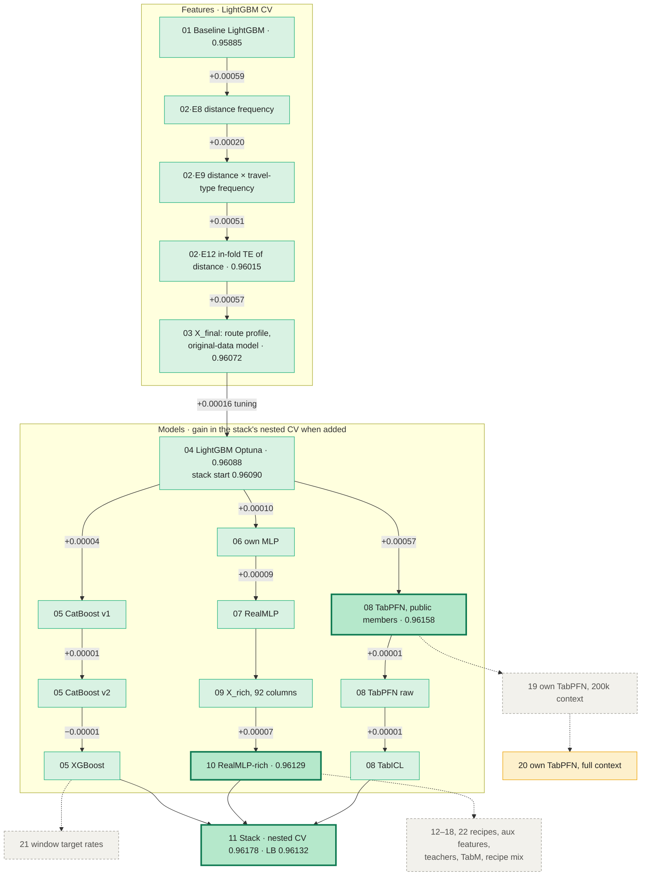

# Kaggle Playground S6E10 — Airline Passenger Satisfaction

Predict whether a passenger is satisfied (binary, metric **ROC-AUC**). ~700k synthetic train rows plus the original survey dataset.

| Final result | |
|---|---|
| Stack of 10 models (logistic regression on logits) | nested CV **0.96178**, public LB **0.96132** |
| Position | 124th of 734 (2026-10-05) |
| Submissions | main `submission_stack_10models.csv`, backup `submission_stack_8models.csv` (CV 0.96168, LB 0.96124) |
| Status (2026-10-10) | stack frozen; notebook `20` (own TabPFN, full context) pending. Deadline 31 Oct 2026 |

## Key takeaways

1. **Only information about *other rows* moved the score:** frequencies and target encoding of the route, a model trained on the original survey, and in-context models (TabPFN). New functions of a row's own columns never helped.
2. **TabPFN and RealMLP-rich carry the stack.** Removing TabPFN costs −0.00015, RealMLP-rich −0.00007, any other member ≤ 0.00001.
3. **Stacking pays only with learned weights:** logistic regression +0.00020 over the best single model, the plain mean −0.00014.
4. **After the 10-model stack, eleven more ideas** (recipes, aux features, teachers, TabM, own TabPFN, window encodings) all landed within ±0.0001.

## Method map

How the solution grew, step by step. Feature steps: gain in LightGBM CV. Model steps: gain in the stack's nested CV when the model was added.

Green = kept, bold = carries the stack, grey dashed = tested and rejected, yellow = pending.

## Notebooks

**Main pipeline** (run in this order; `11` last):

| # | Notebook | What it does | CV AUC |
|---|---|---|---|
| 00 | `00_eda` | Data quality, distributions, every feature vs target → modelling decisions | – |
| 01 | `01_baseline` | Untuned LightGBM on the 21 raw columns: the reference | 0.95882 |
| 02 | `02_features_experiments` | ~15 feature ideas one at a time; keeps route frequencies and route target encoding | 0.96015 |
| 03 | `03_final_features` | Frozen 45-column `X_final` (frequencies, route profile, original-data model) | 0.96072 |
| 04 | `modelling_notebooks/04_lgbm_optuna` | LightGBM tuned with Optuna | 0.96088 |
| 05 | `…/05_cat_xgb` | CatBoost (2 variants), XGBoost | 0.96064 / 0.96066 |
| 06 | `…/06_mlp` | Own PyTorch MLP | 0.96043 |
| 07 | `…/07_realmlp` | RealMLP (pytabkit), 3 seeds | 0.96082 |
| 08 | `…/08_tabpfn_import` | Public TabPFN / TabICL predictions, checked against our folds | 0.96158 |
| 09 | `…/09_features_rich` | `X_rich`, 92 columns for neural nets | – |
| 10 | `…/10_realmlp_rich` | RealMLP on `X_rich` with in-fold target encoding, 3 seeds | 0.96129 |
| 11 | `…/11_stack` | Logistic-regression stack, nested CV | **0.96178** |

**Later experiments** (optional, none entered the stack). Tested on fold 0 against a same-machine reference (RealMLP-rich 0.96138) and in a fold-0 mini-stack.

| # | Idea | Result | |
|---|---|---|---|
| 12 | Second RealMLP recipe | +0.00000 | rejected |
| 13→14 | Aux features v1: each rating predicted from the other columns | +0.000005 | rejected |
| 15 | TabM, a new network family | mini-stack −0.00001 | rejected |
| 16→17 | Teacher models trained on the original survey | ≤ +0.00009, mini-stack ≤ +0.00003 | rejected |
| 18 | Average of three RealMLP-rich variants | stack +0.00002 | rejected |
| 19 | Own TabPFN-3.5, 200k context | mini-stack ≈ 0 | rejected |
| 20 | Own TabPFN, full context (runs on Kaggle) | – | pending |
| 21 | XGBoost + window target rates | −0.00002 | rejected |
| 22 | Aux features v2: multiclass rating probabilities | +0.00006 | rejected |

Each notebook opens with a table (input, output, runtime, result), explains the *why* of every step and ends with *Results & decisions* and a glossary.

## Reproducing

- **Data:** competition files and `orig_data.csv` in `data/raw/`; public TabPFN predictions (goodpjw2008) in `data/external/s6e10-tabpfn-member/`. Generated features go to `data/processed/`, predictions to `preds/` (`oof_<name>.npy`, `test_<name>.npy`, per-fold checkpoints). These folders are not in git.
- **Paths:** notebooks run from their own folder; `../data` and Kaggle paths are resolved automatically.
- **Environment:** conda `kaggle-playground`, versions pinned in `../environment.yml`. Notebooks 04–11 were run on a MacBook Air M4 (CPU), 12–22 on an RTX 3070 Ti; results agree within seed noise.
- **Validation:** 5-fold `StratifiedKFold(shuffle=True, random_state=42)` everywhere. A new idea is accepted only if the stack's nested CV gains ≥ +0.00003 and is positive on ≥ 4 of 5 folds. Final submissions are chosen by CV, not by the public LB (noise ±0.0003–0.0005).

## Credits

goodpjw2008 (TabPFN member dataset), Flight Log V3 notebook, Demidov (RealMLP recipe).
