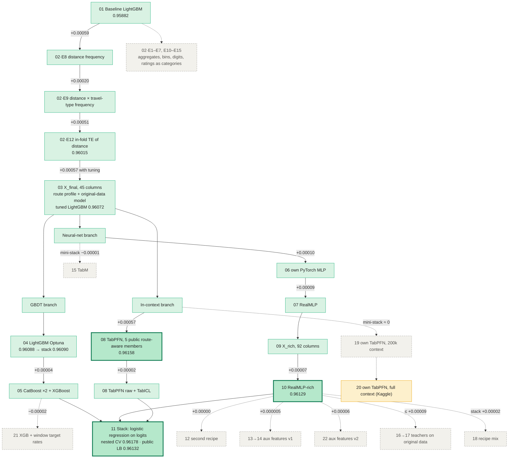

# Kaggle Playground S6E10 — Airline Passenger Satisfaction

Binary classification (satisfied / not), metric **ROC-AUC**. Tabular data, ~700k train rows plus the original survey dataset as an extra source.

**Status (2026-10-10):** stack of 10 models, nested CV **0.96178**, public LB **0.96132** (124th of 734 on 2026-10-05; top-1 then 0.96176, 0.96243 on 2026-10-10). Ten further experiments (`12`–`22`) added no member that passes the acceptance rule; `20` (own TabPFN with full context, run on Kaggle) is still pending. Deadline: 31 Oct 2026.

## Folder structure

```
.
├── README.md
├── 00_eda.ipynb                     # EDA
├── 01_baseline.ipynb                # untuned LightGBM reference
├── 02_features_experiments.ipynb    # feature experiments (E1-E15)
├── 03_final_features.ipynb          # frozen feature set X_final
├── modelling_notebooks/             # 04-11: models, features for NNs, stack; 12-22: later experiments
├── data/
│   ├── raw/          # train.csv, test.csv, sample_submission.csv, orig_data.csv (original survey)
│   ├── external/     # s6e10-tabpfn-member/  (public TabPFN predictions, goodpjw2008)
│   └── processed/    # X_final_*, X_rich_*, X_aux_*, X_auxmc_*, X_teach_*, y_train (parquet/csv)
├── preds/            # OOF + test predictions per model (oof_*.npy, test_*.npy), fold checkpoints, stack submissions
├── submissions/      # files actually sent to Kaggle
└── archive/          # old drafts and backups
```

Each notebook is run from **its own folder** (Jupyter default): the root notebooks (`00_*`–`03_*`) read `data/...`, the ones in `modelling_notebooks/` read `../data`, `../preds`. Both layouts are resolved automatically; on Kaggle the paths fall back to `/kaggle/input` and `/kaggle/working`.

## Method map

How the solution grew, one method at a time. The feature track is measured with LightGBM CV; the model track with the **nested CV of the stack** when each model is added in the order it was built. Green = kept, grey dashed = tested and rejected, yellow = pending.



**Reading the map**

| Step | Gain | Why it worked (or not) |
|---|---|---|
| Frequency + target encoding of distance (`02`) | +0.0013 | information about *other rows* with the same route, which a tree cannot compute from one row |
| `X_final`: route profile, original-data model, tuning (`03`–`04`) | +0.0007 | more cross-row information plus a model trained on the original survey |
| GBDT variants (`05`) | +0.00004 | near-copies of LightGBM (Spearman 0.99) |
| Neural nets (`06`, `07`, `10`) | +0.00026 | a different inductive bias; RealMLP on `X_rich` is the second pillar of the stack |
| TabPFN (`08`) | **+0.00057** | in-context model that looks at similar rows directly; the largest single step |
| Stack vs best single model (`11`) | +0.00020 | learned weights; the plain mean of logits loses (−0.00014) |
| Everything after `11` | ≤ ±0.0001 | new functions of a row's own columns, new recipes and new families repeat what the stack already knows |

Gains depend on the order of addition. Removing one member from the final 10-model stack costs: TabPFN −0.00015, RealMLP-rich −0.00007, every other member ≤ 0.00001. The GBDTs and the own MLP are therefore almost free riders once TabPFN and RealMLP-rich are in.

## Pipeline

### Analysis and features (root folder)

| # | Notebook | What it does | CV AUC |
|---|----------|--------------|--------|
| 00 | `00_eda` | Explores data quality, distributions and the link of every feature to the target; turns findings into modelling decisions | – |
| 01 | `01_baseline` | Untuned LightGBM on the 21 raw columns: the reference score every later idea must beat | 0.95882 |
| 02 | `02_features_experiments` | Tests ~15 feature ideas one at a time against the baseline; keeps frequency and target-encoding features | 0.96015 |
| 03 | `03_final_features` | Builds and saves the frozen 45-column feature set `X_final` (frequencies, route profile, original-data model signal) | 0.96072 (tuned LightGBM) |

### Modelling (`modelling_notebooks/`)

| # | Notebook | What it does | CV AUC |
|---|----------|--------------|--------|
| 04 | `04_lgbm_optuna` | Tunes LightGBM with Optuna on `X_final`; saves its predictions for the stack | 0.96088 |
| 05 | `05_cat_xgb` | CatBoost (two variants) and XGBoost on `X_final` | 0.96064 / 0.96062 / 0.96066 |
| 06 | `06_mlp` | Own PyTorch neural network, built and tuned step by step | 0.96043 |
| 07 | `07_realmlp` | RealMLP (pytabkit) with the community recipe on `X_final`, 3 seeds | 0.96082 |
| 08 | `08_tabpfn_import` | Imports public TabPFN predictions after verifying they match our folds | 0.96158 / 0.96089 |
| 09 | `09_features_rich` | Builds `X_rich` (92 columns): digit features, delays, GPT-2 token keys, original-survey rates, second original-data model | – |
| 10 | `10_realmlp_rich` | RealMLP on `X_rich` with in-fold target encoding, 3 seeds | 0.96129 |
| 11 | `11_stack` | Combines all models' out-of-fold predictions with logistic regression and evaluates the result with nested CV (**run last**) | 0.96178 |

### Later experiments (`modelling_notebooks/`, all rejected)

Each was tested on fold 0 first against a reference trained on the same machine with the same seed (RealMLP-rich, fold 0: 0.96138), and, for new model families, with a fold-0 "mini-stack" (the 10 members ± the new model, inner 5-fold CV).

| # | Notebook | Idea | Fold-0 / stack result | Decision |
|---|----------|------|------------------------|----------|
| 12 | `12_realmlp_rich_recipe` | Second RealMLP recipe (`flat_anneal`, lighter weight decay, fast-decaying dropout, 3 epochs) | +0.00000 | rejected |
| 13 | `13_aux_features` | 32 label-free features: expected value of 16 columns predicted from the other 20 (cross-predicted LightGBM), and the deviation from it | built (≈ 7 min) | used in 14 |
| 14 | `14_realmlp_rich_aux` | RealMLP-rich + the aux features | +0.000005 | rejected |
| 15 | `15_tabm` | TabM (k = 32, piecewise-linear embeddings) as a new network family | single 0.96075; mini-stack −0.00001 | rejected |
| 16 | `16_teachers_orig` | Two more teachers trained only on the original survey (XGBoost depth 8, RealMLP) | built (≈ 2 min) | used in 17 |
| 17 | `17_realmlp_rich_teach` | RealMLP-rich + teacher logits, delay twins, two new in-fold TE keys | ≤ +0.00009; mini-stack ≤ +0.00003 | rejected |
| 18 | `18_realmlp_rich_mix` | Average of three RealMLP-rich variants (two recipes, two inputs), 8 networks, all folds | stack nested CV +0.00002 (bar +0.00003) | rejected |
| 19 | `19_tabpfn_own` | Own TabPFN-3.5 with route-aware inputs (TE of distance, distance × class, original-data logits), 200k context | single 0.96061 (fold 0); mini-stack ≈ 0 | rejected |
| 20 | `20_tabpfn_full_kaggle` | The same TabPFN with the full training part as context (up to 560k rows), Kaggle 2×T4 | – | **pending** |
| 21 | `21_xgb_window_te` | XGBoost + target rates over value windows (distance ±10/50/200 km, age, delay), cross-fitted | −0.00002; mini-stack −0.00001 | rejected |
| 22 | `22_aux_multiclass` | Aux features v2: per-rating multiclass XGBoost, expected value and probability of the actual rating | +0.00006; mini-stack +0.00001 | rejected |

**What they show together:** every kind of addition lands within ±0.0001 of the reference. What moved the score in this project was information from *other rows* (frequencies, target encodings, the original survey, in-context models); more functions of a row's own columns, new recipes and new network families did not.

Numbers follow the order in which the work was done, and the stack (`11`) is rerun after every new model. **Run order from scratch:** 00_eda → 01_baseline → 02_features_experiments → 03 → 04 → 05 → 06 → 07 → 08 → 09 → 10 → **11 last**. Notebooks 12–22 are optional (they do not feed the stack); 14 needs 13, 17 and 18 need 16; 20 runs on Kaggle.

## How the notebooks are written

Every notebook follows the same layout, so any of them can be read on its own:

1. **Header table:** pipeline position, input, output, runtime, headline result, and a glossary of the terms used.
2. **Sections with a "why":** each step says what is done and the reason for the decision, not only the code.
3. **Comments in code** at non-obvious places (leakage guards, fold logic, scale conventions).
4. **"Results & decisions" / "Summary" at the end:** the key numbers, what was accepted or rejected, and what goes to the next notebook.

Long notebooks (`02_features_experiments`, `03_final_features`, `04_lgbm_optuna`) are stored without cell outputs; their key numbers are written in the markdown conclusions.

## Results

| Model | CV | LB |
|-------|----|----|
| LGBM tuned | 0.96088 | |
| CatBoost / XGBoost | 0.96064 / 0.96066 | |
| own MLP | 0.96043 | |
| RealMLP (3 seeds) | 0.96082 | |
| RealMLP-rich (3 seeds) | 0.96129 | |
| TabPFN members | 0.96158 | |
| Stack, 6 models | | 0.96118 |
| Stack, 8 models | | 0.96124 |
| **Stack, 10 models** | **0.96178 (nested)** | **0.96132** |
| TabM (15, fold 0 only) | 0.96075 (fold 0) | |
| RealMLP-rich recipe mix (18) | 0.96134 | |
| Stack, mix replaces RealMLP-rich (18) | 0.96180 (nested, +0.00002: below the bar) | |

Final two Kaggle submissions are chosen by nested CV, not by the public LB (noise ±0.0003–0.0005): **main** `submission_stack_10models.csv` (CV 0.96178, LB 0.96132), **backup** `submission_stack_8models.csv` (CV 0.96168, LB 0.96124; built earlier from older member versions, so a genuinely different composition).

## Conventions

- 5-fold `StratifiedKFold(shuffle=True, random_state=42)` everywhere, so OOF predictions are stackable.
- A new idea is accepted only if the stack's nested CV gains ≥ +0.00003 and is positive on ≥4 of 5 folds (test on fold 0 first).
- Long jobs checkpoint per fold into `preds/*_folds*/`; rerunning a notebook resumes from the checkpoints. Delete the folder to retrain.
- `preds/` is deliberately flat: notebooks write and resume from these names.

## Environment

conda `kaggle-playground` (Python 3.12), versions pinned in `../environment.yml` (pytabkit 1.7.3, torch 2.14.1, scikit-learn 1.9.1, pandas 2.3.3, …): lightgbm, xgboost, catboost, optuna, pytabkit, tiktoken (for 09), scikit-learn. Hardware: MacBook Air M4 (CPU; notebooks 04–11), home PC with RTX 3070 Ti (CUDA build of torch; notebooks 12–19, 21–22 — RealMLP-rich takes ≈ 1.5 min per fold there vs ≈ 4.8 min on the Mac CPU), Kaggle GPU. The GPU reproduces the Mac's RealMLP results within seed noise (fold 0: 0.96138 vs 0.96134).

## Git hygiene

Suggested `.gitignore`: `data/`, `preds/`, `submissions/`, `*.csv`, `*.parquet`, `*.npy`, `*.pkl`, `catboost_info/`, `lightning_logs/`, `__pycache__/`, `.ipynb_checkpoints/`, `.DS_Store`.

## Credits

goodpjw2008 (TabPFN member dataset), Flight Log V3 notebook, Demidov (RealMLP recipe).
